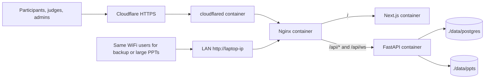

# Windows 10/11 Laptop Event Deployment

This is the safe event-day hosting guide for running DigiHunt on a Windows 10 laptop for 200+ concurrent participants, judges, and admins. It keeps the current Docker + Cloudflare Tunnel path and adds an optional LAN port override for same-room access and large PPT uploads.

Use this with `docs/EVENT_DAY_RUNBOOK.md`. Do not migrate to a VPS during the event.

## Capacity target

This setup is intended for about 200 concurrent users if the laptop and network are reasonable:

- Prefer wired Ethernet from laptop to router.
- Use at least 4 CPU cores and 8GB RAM if available.
- Keep the laptop plugged in, awake, cool, and on a stable network.
- Cloudflare Tunnel is fine for normal pages, API calls, and WebSockets.
- Cloudflare free/proxied paths still cap uploads around 100MB. For larger PPTs, use the LAN URL below.

## Architecture



## 1. Prepare the Windows 10 laptop

1. Plug into power.
2. Use Ethernet if possible. If not, use the strongest WiFi available.
3. Disable sleep while plugged in:
   - Settings → System → Power & sleep
   - Set plugged-in sleep to **Never**.
4. Set Power mode to **Best performance** if available.
5. Keep the lid open or configure closing the lid to do nothing.
6. Close heavy apps, browsers with many tabs, games, sync tools, and video calls.
7. Keep Windows Firewall enabled.
8. If using LAN access, make the current network **Private**, not Public.
9. Do not reboot or update Windows during the event.

## 2. Install WSL 2 and Ubuntu

Open PowerShell as Administrator:

```powershell
wsl --install -d Ubuntu-22.04
wsl --set-default-version 2
```

If `wsl --install` is not available on your Windows 10 build, install **Windows Subsystem for Linux** and **Ubuntu 22.04 LTS** from the Microsoft Store, then reboot.

Open Ubuntu from the Start menu and run:

```bash
sudo apt update
sudo apt upgrade -y
sudo apt install -y git openssl curl ca-certificates
```

## 3. Install Docker Desktop

1. Install Docker Desktop for Windows from <https://www.docker.com/products/docker-desktop/>.
2. During setup, enable **Use WSL 2 instead of Hyper-V**.
3. Start Docker Desktop.
4. Settings → General:
   - Enable **Start Docker Desktop when you sign in**.
   - Ensure **Use the WSL 2 based engine** is enabled.
5. Settings → Resources:
   - CPUs: 4 or more if available.
   - Memory: 6GB minimum, 8GB or more preferred.
   - Swap: 2GB or more.
6. Settings → Resources → WSL Integration:
   - Enable integration for Ubuntu.
7. In Ubuntu, verify:

```bash
docker version
docker compose version
```

## 4. Clone or update the repository inside WSL

Do not run the project from `C:\`. Use the Ubuntu filesystem.

Fresh setup:

```bash
mkdir -p ~/projects
cd ~/projects
git clone https://github.com/OmegaThePoggers/IETE-SF-Digihunt.git
cd IETE-SF-Digihunt
```

Existing setup:

```bash
cd ~/projects/IETE-SF-Digihunt
git pull origin main
```

## 5. Create production data directories

Production data is stored in bind mounts so emails, password hashes, PPTs, and uploads survive rebuilds and are visible on the laptop.

```bash
mkdir -p data/postgres data/ppts data/uploads backups secrets
sudo chown -R 999:999 data/postgres
sudo chown -R 10001:10001 data/ppts data/uploads
```

Locations:

| Data | Laptop path inside WSL |
|---|---|
| PostgreSQL DB, emails, password hashes | `~/projects/IETE-SF-Digihunt/data/postgres` |
| PPT submissions | `~/projects/IETE-SF-Digihunt/data/ppts` |
| Other uploads | `~/projects/IETE-SF-Digihunt/data/uploads` |

Never run `docker compose down --volumes` on production.

## 6. Configure Cloudflare Tunnel

In Cloudflare Zero Trust:

1. Go to **Networks → Tunnels**.
2. Create or open the DigiHunt tunnel.
3. Connector type: Docker.
4. Copy the tunnel token.
5. Public hostname:
   - Subdomain: `hunt` or your chosen name.
   - Domain: your domain.
   - Service type: `HTTP`.
   - URL: `nginx:80`.

The public URL should be like `https://hunt.example.com`.

## 7. Create `.env.production` and secrets

```bash
cp .env.production.example .env.production
nano .env.production
```

Minimum values:

```env
PUBLIC_HOSTNAME=hunt.yourdomain.com
POSTGRES_DB=digihunt
POSTGRES_USER=digihunt
ACCESS_TOKEN_EXPIRE_MINUTES=480
MAX_UPLOAD_BYTES=1073741824
```

Create secrets:

```bash
openssl rand -base64 32 > secrets/postgres_password.txt
openssl rand -base64 64 > secrets/jwt_secret.txt
printf 'PASTE_CLOUDFLARE_TUNNEL_TOKEN_HERE' > secrets/cloudflared_token.txt
chmod 600 secrets/*.txt
```

Replace `PASTE_CLOUDFLARE_TUNNEL_TOKEN_HERE` with the real token. Do not add quotes.

## 8. Start production for Cloudflare only

Use this if everyone will access through Cloudflare and PPTs are under 100MB:

```bash
alias dprod='docker compose --env-file .env.production -f compose.production.yaml'
dprod up --build -d
dprod ps
dprod exec nginx wget -qO- http://127.0.0.1/healthz
```

## 9. Start production with LAN backup enabled

Use this for the event laptop. It keeps Cloudflare working and also exposes nginx on laptop port 80 for same-WiFi users and large PPT uploads.

```bash
alias dprod='docker compose --env-file .env.production -f compose.production.yaml -f compose.laptop.yaml'
dprod up --build -d
dprod ps
curl -fsS http://localhost/healthz
```

Allow inbound HTTP on Windows Firewall for Private networks only. Run PowerShell as Administrator:

```powershell
New-NetFirewallRule -DisplayName "DigiHunt HTTP 80" -Direction Inbound -Protocol TCP -LocalPort 80 -Action Allow -Profile Private
```

Find the laptop IP:

```powershell
ipconfig
```

Share this URL only with people on the same WiFi/LAN:

```text
http://<laptop-lan-ip>
```

Test from a phone on the same WiFi before participants begin.

## 10. Account CLI

Run on the laptop inside Ubuntu:

```bash
dprod exec backend python -m app.cli create-user --role admin --name "Admin" --email admin@example.com
dprod exec backend python -m app.cli create-user --role judge --name "Judge 1" --email judge1@example.com
dprod exec backend python -m app.cli list-users
```

Forgotten password:

```bash
# One user
dprod exec backend python -m app.cli reset-password --email user@example.com

# Whole participant team, shared password
dprod exec backend python -m app.cli reset-team-password --team-code DGH-001
```

Generated passwords are printed once. Copy them immediately.

## 11. 200+ concurrent readiness checklist

Before opening registration:

1. `dprod ps` shows all services healthy.
2. `curl -fsS http://localhost/healthz` returns `ok` when LAN override is enabled.
3. Public Cloudflare URL opens from a phone using mobile data.
4. LAN URL opens from a phone on the same WiFi.
5. Register one test team, log in, solve a question, and confirm progress saves.
6. Upload and download a small PPT.
7. Judge login opens the judge dashboard.
8. `dprod exec backend python -m app.cli list-users` works.
9. `docker stats` shows the laptop is not pinned at 100% CPU or out of memory while testing.
10. Take a backup after setup.

During the event, keep this running in one Ubuntu terminal:

```bash
docker stats
```

Keep logs available in another terminal:

```bash
dprod logs --tail=100 -f backend nginx cloudflared
```

If the laptop slows down, do not restart everything first. Close other apps, check `docker stats`, then restart only the unhealthy service:

```bash
dprod restart backend
# or
dprod restart frontend
# or
dprod restart nginx
```

## 12. Backups

Create a database dump:

```bash
mkdir -p backups
stamp=$(date +%Y%m%d-%H%M%S)
dprod exec -T db pg_dump -U digihunt digihunt > backups/db-$stamp.sql
```

Archive PPT files:

```bash
stamp=$(date +%Y%m%d-%H%M%S)
tar -czf backups/ppts-$stamp.tar.gz -C data/ppts .
```

Take one backup after registration closes and one after all PPTs are uploaded.

## 13. Event-day rules

- Do not deploy non-critical changes during the event.
- Do not run demo seed on production.
- Do not run `dprod down --volumes`.
- Do not reboot Windows unless the site is already unusable.
- If Cloudflare fails, give participants the LAN URL.
- If a PPT is over 100MB, use the LAN URL for that upload.

## 14. Shutdown after the event

Create final backups first. Then stop the stack:

```bash
dprod down
```

This preserves database and upload data. Again, do not use `--volumes` unless you intentionally want to delete production data.
