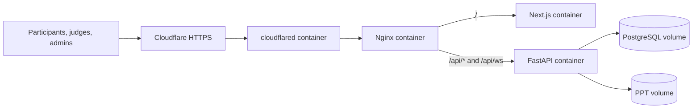

# Windows 11 Laptop Production Deployment

This guide turns an old Windows 11 laptop into the DigiHunt event server using Docker, Nginx, and Cloudflare Tunnel. It uses one public hostname, for example `hunt.example.com`, and needs no router port forwarding.

## Architecture



Only Cloudflare Tunnel reaches the laptop. PostgreSQL, FastAPI, and Next.js do not publish host ports in production.

## 1. Prepare Windows 11

1. Plug the laptop into power.
2. Use wired Ethernet if available.
3. Run Windows Update fully before event day.
4. Disable sleep while plugged in:
   - Settings → System → Power → Screen and sleep
   - Set plugged-in sleep to **Never**.
5. Keep Windows Firewall enabled.
6. Do **not** create inbound firewall rules.
7. Do **not** configure router port forwarding.
8. Enable BitLocker or Device Encryption if Windows supports it.
9. Sign in with a normal Windows account. Do not use Windows auto-login for the event laptop.

## 2. Install WSL 2 and Ubuntu

Open PowerShell as Administrator:

```powershell
wsl --install -d Ubuntu-24.04
wsl --set-default-version 2
```

Reboot if Windows asks. Open Ubuntu from the Start menu, create a Linux username, then update it:

```bash
sudo apt update
sudo apt upgrade -y
sudo apt install -y git openssl curl ca-certificates
```

## 3. Install Docker Desktop

1. Install Docker Desktop for Windows from <https://www.docker.com/products/docker-desktop/>.
2. During setup, enable **Use WSL 2 instead of Hyper-V**.
3. Open Docker Desktop.
4. Settings → General:
   - Enable **Start Docker Desktop when you sign in**.
   - Ensure **Use the WSL 2 based engine** is enabled.
5. Settings → Resources → WSL Integration:
   - Enable integration for Ubuntu 24.04.
6. In Ubuntu, verify Docker works:

```bash
docker version
docker compose version
```

## 4. Clone the repository inside WSL

Do not run the project from `C:\`. Clone it inside Ubuntu so Docker volumes and file access are reliable.

```bash
mkdir -p ~/projects
cd ~/projects
git clone https://github.com/OmegaThePoggers/IETE-SF-Digihunt.git
cd IETE-SF-Digihunt
```

## 5. Move your domain to Cloudflare

Since the domain is not yet on Cloudflare:

1. Create or open a Cloudflare account.
2. Add your domain.
3. Cloudflare will show two nameservers.
4. Open your domain registrar.
5. Replace the registrar nameservers with Cloudflare's nameservers.
6. Wait until Cloudflare marks the domain **Active**.
7. In Cloudflare, set SSL/TLS mode to **Full**.
8. Enable **Always Use HTTPS**.
9. Ensure WebSockets are enabled. This is normally on by default.

## 6. Create the Cloudflare Tunnel

In Cloudflare Zero Trust:

1. Go to **Networks → Tunnels**.
2. Create a tunnel.
3. Choose **Cloudflared**.
4. Name it `digihunt-laptop`.
5. Choose Docker as the connector type.
6. Copy the tunnel token.
7. Add a public hostname:
   - Subdomain: `hunt`
   - Domain: your domain
   - Service type: `HTTP`
   - URL: `nginx:80`

The final public URL will be like `https://hunt.example.com`.

## 7. Create production environment and secrets

From the repo root inside Ubuntu:

```bash
cp .env.production.example .env.production
nano .env.production
```

Set:

```env
PUBLIC_HOSTNAME=hunt.yourdomain.com
POSTGRES_DB=digihunt
POSTGRES_USER=digihunt
ACCESS_TOKEN_EXPIRE_MINUTES=480
```

Create secrets:

```bash
mkdir -p secrets
openssl rand -base64 32 > secrets/postgres_password.txt
openssl rand -base64 64 > secrets/jwt_secret.txt
printf 'PASTE_CLOUDFLARE_TUNNEL_TOKEN_HERE' > secrets/cloudflared_token.txt
chmod 600 secrets/*.txt
```

Replace `PASTE_CLOUDFLARE_TUNNEL_TOKEN_HERE` with the token from Cloudflare. Do not add quotes or extra spaces.

## 8. Start production

```bash
docker compose --env-file .env.production -f compose.production.yaml up --build -d
```

Check health:

```bash
docker compose --env-file .env.production -f compose.production.yaml ps
docker compose --env-file .env.production -f compose.production.yaml logs -f cloudflared nginx backend
```

Open:

```text
https://hunt.yourdomain.com
```

## 9. First production setup

Run migrations automatically by starting the stack. Then create real event users through registration or admin tooling available in the app.

Do **not** run the demo seed on production:

```bash
# Do not run this on production
docker compose exec backend python -m app.seed
```

Demo accounts are for local testing only.

## 10. Updating the server during preparation

Before the event, update from GitHub like this:

```bash
cd ~/projects/IETE-SF-Digihunt
git pull origin main
docker compose --env-file .env.production -f compose.production.yaml up --build -d
```

Do not update during the live event unless absolutely necessary.

## 11. Backup before the event

Create a database dump:

```bash
mkdir -p backups
stamp=$(date +%Y%m%d-%H%M%S)
docker compose --env-file .env.production -f compose.production.yaml exec -T db pg_dump -U digihunt digihunt > backups/digihunt-$stamp.sql
```

Archive uploaded PPT files:

```bash
stamp=$(date +%Y%m%d-%H%M%S)
docker run --rm -v digihunt-prod_ppt_data:/ppts:ro -v "$PWD/backups:/backups" alpine tar -czf /backups/ppts-$stamp.tar.gz -C /ppts .
```

Make one backup after setup, one right before participants begin, and one after the event ends.

## 12. Event-day checklist

- Laptop plugged in.
- Sleep disabled.
- Ethernet connected or stable Wi-Fi verified.
- Docker Desktop running.
- Cloudflare Tunnel status is healthy.
- `https://hunt.yourdomain.com` opens from a phone using mobile data.
- Registration/login tested with a fresh team.
- Judge login tested.
- Round 3 upload/download tested.
- No demo seed run on production.

## 13. Shutdown after the event

Create final backups first. Then stop the stack:

```bash
docker compose --env-file .env.production -f compose.production.yaml down
```

This preserves database and upload volumes. Do not run `--volumes` unless you intentionally want to delete production data.
